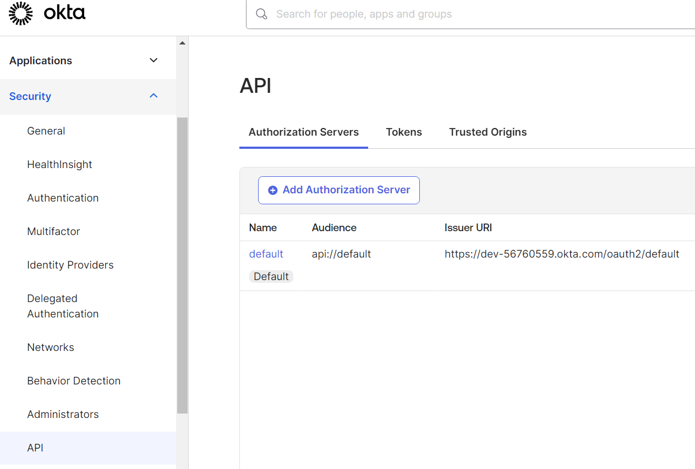

## Global TODOs

1. (POLISHING) Fixed domain validation, but need to remove same validation bpp configuration from all services
2. (POLISHING) Docker build fails due to corrupted wrapper being passed to container on build
3. (MINOR) Create guide for configuring okta.dev
4. (MINOR) Maybe include some criteria like stuff in domain in RetrievalPorts
5. (MINOR) Make jpa hibernate adapters return references by id (not fetching) or something
6. (MINOR) Kafka deserialization automatic conversion (for now it's the `commons.integration-dto` stuff):
   - Producer sends {a, b, c}: ProducerClass,
   - Consumer receives {a, c}: ConsumerClass (for example), automatically converts json
     and delegates to correct `@KafkaHandler` (by parameter Type)

   No dependencies, no unnecessary fields, cool in general
7. (MINOR) Use Redisson for multi-instance lock consistency
8. (CRITICAL) Cache adapters will fail synchronization if the lock is used longer than set expiration time
   as the still active lock will be deleted from cache, and new one will be created for same key on the upcoming request
9. (POLISHING) Remove duplication in application properties, exception handling and some other stuff
10. (MINOR) Use error codes instead of messages in exceptions
11. (MEDIUM) Define schema.sql with constraints, indexes and other staff (and disable hibernate ddl)
12. (MINOR) Eureka and other spring cloud staff
13. (MINOR) Something wrong with noop notification port for service module
14. (MINOR) k8s config (also `gateway` module isn't needed at all in that case)
15. (MINOR) notification port for reservations
16. (MINOR) sse for reservations
17. (MINOR) by-service route for staff module (if staff ever have been assigned a schedule for service - he should be included)
18. (MEDIUM) Migrate to different authorization server, okta does not have profile picture attribute (or at least I don't know the way to get it)
19. (MINOR) add maxReservationsFromSameUser field to slot and check compliance with the restriction
20. (MEDIUM) too much code duplication, move to common module at least
21. (MINOR) make reservations sorted by start time

### Конфигурация Okta
Создать сервер авторизации, использовать issuer-uri (адрес сервера), а также создать и использовать api token
